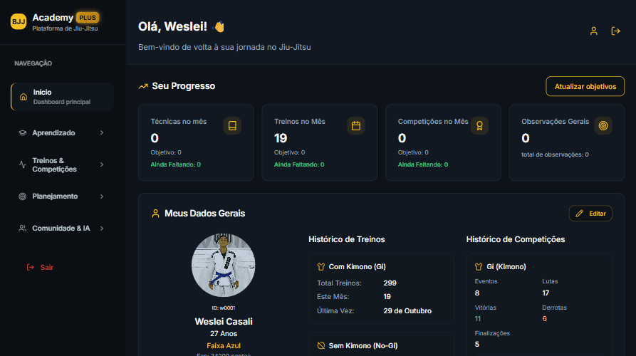

# 🌐 Bjj Academy — Plataforma

## 🧠 Sobre o Projeto

Plataforma completa para praticantes de Jiu Jitsu com diversas funcionalidades e integrações online disponível em: [https://bjjacademy.com.br/](https://bjjacademy.com.br/)

---

## ⚙️ Tecnologias Utilizadas

- PHP (back-end)  
- React (front-end)  
- MySQL como banco de dados  
- TailwindCSS para estilização  
- Hospedado em servidor Linux (ex: Ubuntu + Nginx)  
- Versionamento com Git + GitHub  

